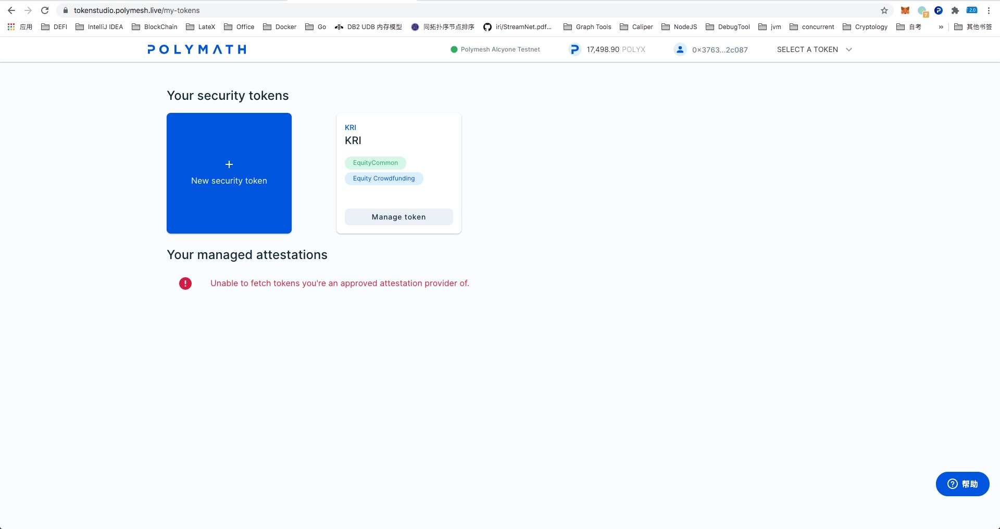

# STO发行

区块链是一项很有前景的技术，它支持诸如以太坊、比特币以及在以太坊、币安智能链等公链上发行的代币和一些安全令牌等加密资产。这些加密资产为金融服务市场带来了巨大的变化。相对于为人所知的代币，安全令牌是一个较为新兴的概念。因此在讨论启动STO（Security Token Offering, 发行安全令牌）之前会首先解释什么是STO以及什么是安全令牌（Security Token）。

安全令牌（Security Token） 是指符合该地区法规并且能够在链外自由交易的资产。与代币不同的是，前者只能在极其特别的服务中使用，而安全令牌代表资产的归属权益，其持有者拥有共享利润、本金、股息，投票以及赎回的权利。

## 安全令牌的种类

## 如何启动STO

### 准备阶段

+ 好的创意

+ 法律边界

  在创建安全token的时候必须要明确相应的法律要求。目前全世界不同国家的要求也不尽相同，比如我国大陆地区就是禁止的，而邻国日本则要求在一定的法律框架下发行。因此发行前需要了解清楚当地的法律。

+ 选择合适的安全令牌平台

  安全令牌的发行与代币不同，因此所需的平台也不相同。以下是一些较为主流的发行平台。

  + [Polymath](https://polymath.network/)

  Polymath提供了使区块链上债券、股票和资产证券化的技术和法律上的解决方案。并且整合了KYC提供者、智能合约开发，法律专家以及币圈投资者等一系列资源为安全令牌构建基础环境。它的运行原理与以太坊网络类似，也有自己的ST-20代币标准，同时也发行了自己的代币POLY。

  

  + [Harbor](https://harbor.com/)

  Harbor 是另一个可以进行STO的区块链平台，在此之上发行的安全令牌受到当前地区法律的约束。

  

  + [Securitize](https://www.securitize.io/)

  与Harbor类似

  

  + [Securrency](https://securrency.com/)

  Securrency 是一个完全证券化平台，并且可以通过简单的拖动就可以启动STO。且其支持的超过160个国家的KYC。

  

  + [Swarm](https://www.swarmnetwork.org/)

  Swarm是一个基于区块链的真实世界的资产代币化平台。其使用SRC20协议，发行代币为SWM。

  

+ 编写白皮书

  对于新产品而言白皮书至关重要，好的白皮书能够带来意想不到营销效果，同样的，如果白皮书写的不好则会对产品造成致命伤害。好的白皮书需要具备以下方面的内容：

  + 法律免责声明

  + 产品详细描述

  + 行业概况

  + 技术架构

  + 业务模型

  + 资产等与代币相关的其他安全类型

  + 代币的设计原理以及使用详情

  + 团队成员和咨询途径

    

    另外，为了是文档便于理解和段落的组织，STO白皮书同时还要考虑一些书写规则，这里就不再赘述，感兴趣的可以参考文档[1]。

+ 组建专家团队

+ 建设介绍网站，主要用于项目介绍和推广

  

### STO第一阶段

+ 市场推广

+ 选择合作交易所

  后文将以Polymath作为实例进行演示

+ 寻找抵押资产的保管机构

  与现实世界的抵押类似，托管人的作用由智能合约实现。目前CoinBase和Prime Trust都可以成为托管人。

+ 创建一个安全令牌

  参见发行一个自己的STO章节。

+ STO营销

  

### STO第二阶段

该阶段是STO的主要执行阶段

+ 众筹

  该阶段企业会在交易所公开发售代币募集资金，也是STO项目的主要阶段。

  部署一个众筹合约用来发售一定数目的代币，同时不要忘记提供社区服务。

+ 社区支持

  启动STO之后要马上成立支持团队用以建立和维护与媒体和投资人的良好关系，有第三方公司可以提供此类服务。

### STO第三阶段

+ 开发产品

  需要注意的开发产品的进度要与STO时的路线图一致。

+ 管理投资人期望

+ 技术支持服务

  

## 如何适当的进行STO

运行STO需要满足以下两个因素：

+ 法律

+ 技术栈选型

  目前可选择的区块链平台有以太坊(L1、L2)、币安智能链等，其gas费用和速度有所差异。另外，选择合适的TOKEN协议也很重要，错误的协议会导致投资人无法安全的保存代币，且对二级市场交易也会造成严重影响。

  基于ERC20协议，以下协议可以用于此场景：

  + ST-20
  + R-Token
  + ERC-1404
  + ERC-1400
  + ERC-1410

## STO服务机构

由于STO的发行较为复杂，行业内诞生了一些帮助企业进行STO的组织机构。在此基础上企业可以专注于业务和产品。

## 发行一个自己的STO

以下将会演示如何在Polymath平台Kovan测试环境发行一个STO.

在此之前，先简单介绍一下Polymath测试网Polymesh Testnet。Polymesh的设计核心是治理（Governance）、身份标志（Identify）、合规（Compliance）以及机密（Confidentiality），通过此设计满足监管需求。

+ 准备metamask账户

  - 使用chrome浏览器安装metamask插件，注册账户。

  - 安装Polymesh Wallet，打开 [dashboard](https://dashboard.polymesh.live/)，点击install Polymesh Wallet

    

  - 从水龙头获取0.1个以太，[水龙头地址](https://zh.enjin.io/software/kovan-faucet)

  - 账户准备好之后打开Polymath网站，点击"new security token" 创建代币。

    

+ 创建Polymath账户

+ 注册token标志

+ 选择合作伙伴

  如果没有合作伙伴可以直接点击”Create token now“。

+ 创建token

+ 设置发行细节

  比如发行的限额、币种等，设置完毕后点击”Confirm and Launch STO“即创建了一个STO

+ 设置投资人白名单

  这是创建token的最后一步，允许白名单的投资人在未来购买安全token。投资人白名单在整个STO阶段是可以修改的。提交验证投资人后即把他们加入到了白名单，投资人发送POLY或者ETH到STO合约会获取STO发行代币。

## 参考

[1] [HOW TO LAUNCH SECURITY TOKEN OFFERING?](https://www.leewayhertz.com/launch-sto-security-token-offering/)

